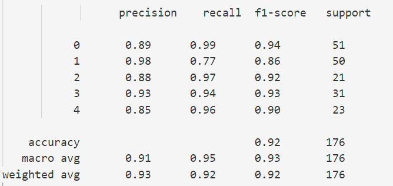

## 实验环境 ##

|    名称     | 版本     |         
| :--------   | :-----  |
| pytorch     | 1.11.0  |
| torchvision | 0.12.0   |
| python      | 3.7.0   |
| scikit-learn | 1.0.2  |
| matplotlib  | 3.5.2   |
| Pillow      | 9.1.0   |
| joblib      | 1.1.0   |

## 实验说明 ##
*对数据增广、对抗训练、损失函数等方法已经集成为类的形式* . 

## 运行方式 ## 
*进行数据增广* . 
python data_increase.py

*运行实验训练模型* . 
python train.py

*进行评估* . 
python evaluate.py

*可视化页面展示* . 
python mcu_image_vision_server.py

## 实验结果展示 ## 
1.ResNet18进行摸底试验 
 

2.ResNet50进行摸底试验  
 

3.ResNet18+数据增广进行试验  
 

4.ResNet18+focal_loss进行试验  
 

5.ResNet18+ghm进行试验  
 

6.ResNet18+标签平滑进行试验  
 

7.ResNet18+fgsm进行试验  
 

8.ResNet18+pgd进行摸底试验  
 

9.ResNet18+数据增广+标签平滑+fgsm进行试验  
 